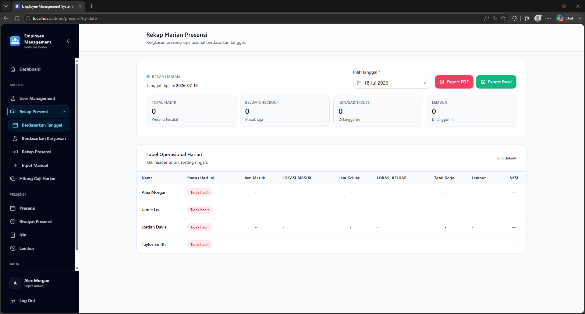
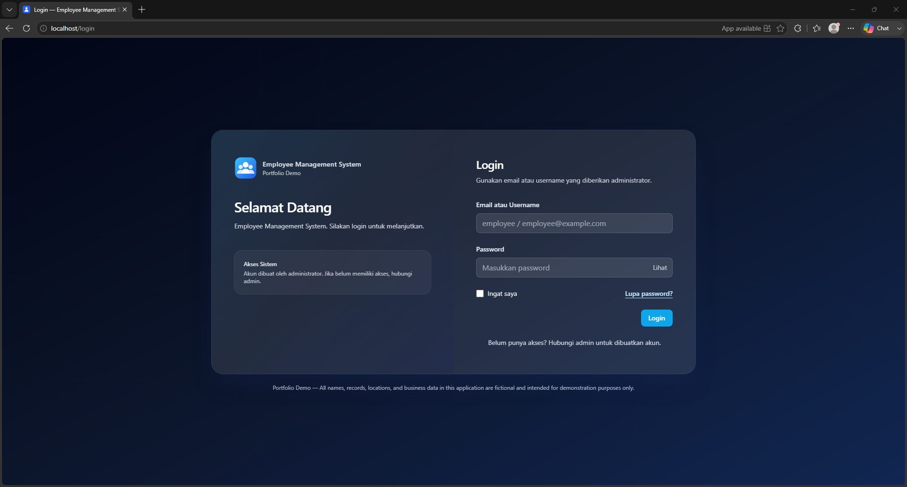
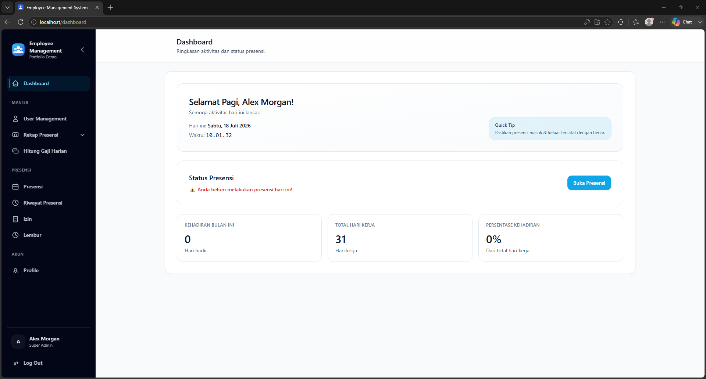
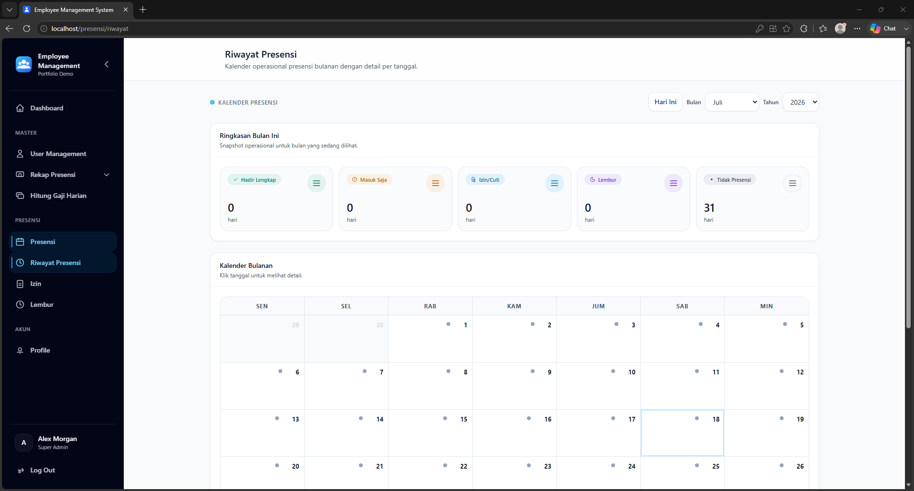
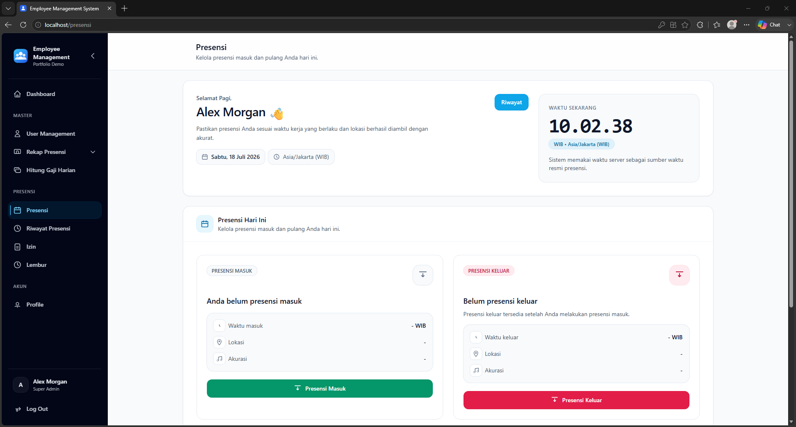
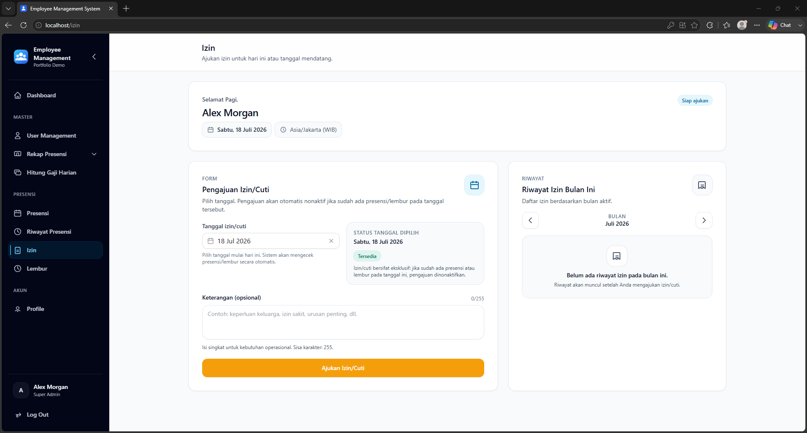
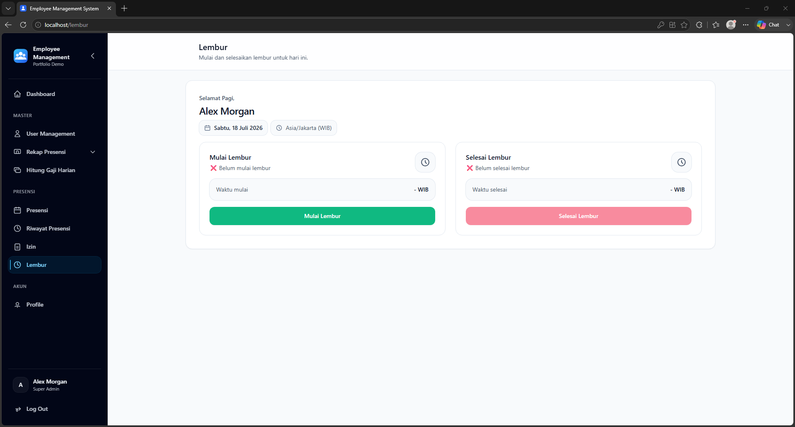
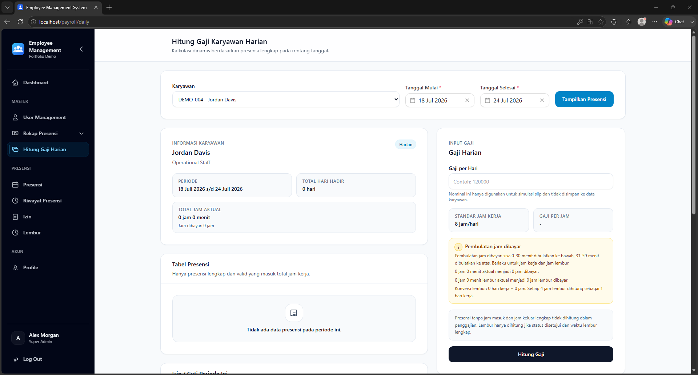

# Employee Management System

A web-based employee management application for attendance, leave, overtime, employee records, operational reporting, daily payroll calculations, and administrative workflows.

This repository is prepared as a portfolio demonstration. It contains only fictional sample data, local development configuration, and sanitized assets. No production credentials or personal records are included.

[](composer.json)
[](composer.json)
[](package.json)
[](LICENSE)

**Portfolio showcase:** [open the static site](https://alzehazeka.github.io/employee-management-system/) · GitHub Pages may not be enabled yet. The showcase is static and does not claim a live Laravel backend demo.

## Problem Statement

Employee operations are often split across spreadsheets, messages, and manual attendance logs. This application brings employee records, timekeeping, leave, overtime, role-based access, and reporting into one responsive web interface while preserving an auditable operational record.

## Application Preview

The daily attendance report is the primary portfolio view because it combines date filtering, operational summaries, sortable employee records, permission-aware controls, and PDF/Excel export paths. All application images shown below use sanitized fictional demo data.



Route: `/admin/presensi/by-date` · Role: `Super Admin`

### Core Workflows

| Access and history | People and attendance |
| --- | --- |
| [](SCREENSHOT_GUIDE.md#01--login) | [](SCREENSHOT_GUIDE.md#02--employee-directory) |
| **Login** — Guest access and authentication entry point.<br>File: `login.png` | **Employee directory** — Search, status, roles, and CRUD entry points.<br>File: `employee-directory.png` |
| [](SCREENSHOT_GUIDE.md#04--attendance-history) | [](SCREENSHOT_GUIDE.md#03--employee-attendance) |
| **Attendance history** — Calendar, monthly status, and day detail.<br>File: `attendance-history.png` | **Employee attendance** — GPS-assisted check-in and check-out states.<br>File: `attendance.png` |

| Leave and overtime | Reporting and payroll |
| --- | --- |
| [](SCREENSHOT_GUIDE.md#05--leave-management) | [](SCREENSHOT_GUIDE.md#07--daily-attendance-report) |
| **Leave management** — Eligibility, submission, and monthly history.<br>File: `leave.png` | **Daily attendance report** — Summary, filtering, sorting, and exports.<br>File: `reports-daily.png` |
| [](SCREENSHOT_GUIDE.md#06--overtime-management) | [](SCREENSHOT_GUIDE.md#08--daily-payroll-detail) |
| **Overtime management** — Start, finish, and safeguarded activity states.<br>File: `overtime.png` | **Daily payroll detail** — Attendance, leave, overtime, and pay summary.<br>File: `payroll-daily.png` |

All preview content and future screenshots must use fictional demo data only. See [SCREENSHOT_GUIDE.md](SCREENSHOT_GUIDE.md) for exact routes, roles, viewport, sanitization rules, and capture order. Source entry points are documented in [`routes/web.php`](routes/web.php), [`resources/js/Pages`](resources/js/Pages), and the shared [sidebar navigation](resources/js/lib/navigation/sidebarNavigation.js).

## Available Features

- Email-or-username authentication, password reset, password/profile updates, and optional two-factor authentication.
- Active/inactive account enforcement at login.
- Hybrid role and permission management with `Super Admin`, `Admin`, and `Karyawan` roles backed by Spatie Laravel Permission.
- Employee directory and CRUD workflows with status, position, salary type, and employment fields.
- GPS-assisted attendance check-in/check-out with accuracy, IP, user-agent metadata, throttling, and duplicate-day safeguards.
- Leave eligibility checks and leave request history.
- GPS-assisted overtime start/finish records.
- Administrative manual attendance/overtime entry with business-rule validation.
- Daily, per-employee, and monthly attendance reports.
- PDF and Excel report export.
- Daily-pay employee calculation and printable payroll detail.
- Responsive Inertia/Vue interface and a minimal installable PWA shell.
- Fictional, idempotent local demo seed data.

## Technology Stack

### Backend

- PHP `^8.3`
- Laravel `^13.0`
- Inertia Laravel `^2.0`
- Laravel Jetstream `^5.5`, Fortify, and Sanctum
- Spatie Laravel Permission `^6.0`
- Laravel DOMPDF `^3.1`
- Laravel Excel `^3.1`

### Frontend

- Vue `^3.5`
- Inertia Vue `^3.1`
- Tailwind CSS `^3.4`
- Vite `^6`
- FullCalendar, Vue Datepicker, and SweetAlert2

### Infrastructure and Tooling

- MySQL 8.4 as the documented database
- Laravel Sail / Docker Compose
- Optional Redis service; database cache is the demo default
- Mailpit for local mail inspection
- PHPUnit 11 and Laravel Pint
- A web manifest and lightweight service worker (no offline data synchronization)

## Architecture Overview

The application is a Laravel modular monolith. HTTP routing and Inertia controllers coordinate use cases, while reusable payroll and attendance calculations live in `app/Services`. Shared domain rules and access helpers live in `app/Support`; request validation is present both in a dedicated Form Request for payroll and inline in older controller flows. Authorization is enforced through middleware and Spatie permissions. Eloquent models provide data access.

The codebase does not currently define Laravel policy classes. Some controllers still contain validation and orchestration logic; this repository documents the actual implementation instead of claiming a completed clean-architecture migration.

## Project Structure

```text
app/Http/Controllers/       Inertia and export endpoints
app/Http/Middleware/        Role and permission enforcement
app/Http/Requests/          Dedicated request validation where implemented
app/Models/                 Employee, attendance, leave, and overtime models
app/Services/               Payroll and operational recap services
app/Support/                Domain rules, location, roles, and permissions
database/migrations/        MySQL-compatible schema
database/seeders/           Roles, demo accounts, and fictional operations
resources/js/               Vue pages, layouts, components, and composables
resources/views/            Laravel root, PDF, print, and fallback views
tests/                      PHPUnit feature and unit tests
docs/                       Backend-independent static portfolio showcase
```

## Requirements

- PHP 8.3 or newer with extensions required by Laravel, MySQL, DOMPDF, and Laravel Excel
- Composer 2
- Node.js 20+ and npm
- MySQL 8.x
- Optional: Docker with WSL2 integration for Laravel Sail

## Local Installation (Without Docker)

```bash
git clone <repository-url> employee-management-system
cd employee-management-system
composer install
npm ci
cp .env.example .env
```

For a host MySQL installation, change `DB_HOST=mysql` to `DB_HOST=127.0.0.1` in `.env` and create an empty database named `employee_management`. Then run:

```bash
php artisan key:generate
php artisan migrate:fresh --seed
php artisan storage:link
npm run build
php artisan serve --host=127.0.0.1 --port=8000
```

Open `http://127.0.0.1:8000`.

## Docker / Laravel Sail Installation

Composer dependencies are required before Sail can build its PHP image because the Compose build context uses the Sail runtime shipped in `vendor`.

```bash
composer install
cp .env.example .env
./sail up -d --build
./sail artisan key:generate
./sail npm ci
./sail artisan migrate:fresh --seed
./sail artisan storage:link
./sail npm run build
```

The Sail application is available at `http://localhost` through host port `80`. Vite remains on `5173`, Mailpit uses `8025`, and phpMyAdmin uses `8080`. Override the corresponding port values in the untracked `.env` if a port is already in use.

## Demo Credentials

The following credentials are seeded only when `APP_ENV=local`:

| Persona | Email | Username | Password | Application role |
| --- | --- | --- | --- | --- |
| Administrator | `admin@example.com` | `administrator` | `password` | `Super Admin` |
| HR Manager | `hr@example.com` | `hr.manager` | `password` | `Admin` |
| Employee | `employee@example.com` | `employee` | `password` | `Karyawan` |

All names, addresses, telephone numbers, records, locations, and payroll amounts are fictional portfolio fixtures.

## Development Commands

```bash
composer run dev
```

Or run the processes separately:

```bash
php artisan serve
npm run dev
```

The demo uses `QUEUE_CONNECTION=sync`; no queue worker is required. If a reviewer changes to an asynchronous queue driver, they must add/configure the corresponding queue tables and run `php artisan queue:work`.

## Database and Demo Data

Reset the local database and rebuild all fictional demo records:

```bash
php artisan migrate:fresh --seed
```

With Sail:

```bash
./sail artisan migrate:fresh --seed
```

MySQL remains the primary database. SQLite compatibility is not claimed unless independently tested against the full migration and feature suite.

## Tests and Quality Checks

```bash
php artisan test
./vendor/bin/pint --test
npm run build
```

There are no npm lint or format-check scripts in the current project. Do not treat `npm run build` as a lint result.

## Storage

Runtime uploads and private storage are excluded from the portfolio copy. Create a local public link only after configuring the local environment:

```bash
php artisan storage:link
```

The default filesystem is local. No production object-storage credentials are included.

## PWA Notes

`public/manifest.webmanifest` and `public/sw.js` provide a minimal installable shell. The service worker currently performs lifecycle registration only; offline caching and background synchronization are not implemented. The normal frontend build command is sufficient:

```bash
npm run build
```

## Static Portfolio Showcase

The `docs/` directory is independent of Laravel, PHP, MySQL, and backend APIs:

```bash
python3 -m http.server 8081 --directory docs
```

Open `http://127.0.0.1:8081`. The showcase uses the eight sanitized PNG screenshots from `docs/assets/images/screenshots/` and does not require Laravel or a backend service.

### GitHub Pages

GitHub Pages does not run the Laravel backend. It serves only the static showcase:

1. Push the reviewed repository to a GitHub repository you created manually.
2. Open **Settings → Pages**.
3. Select **Deploy from a branch**.
4. Select branch `main` and folder `/docs`.
5. Save and wait for the static site deployment.

## Integrations and Local Safety

- Mail is routed to Mailpit in Docker and never to a production SMTP server.
- Queue work runs synchronously in the default demo environment.
- Redis is available in Compose but is not required by the default cache/queue setup.
- The Google API client dependency exists in the source dependency graph, but no active Google integration is wired in application code and no credential file is included.
- No WhatsApp, SMS, push, analytics, error-tracking, cloud storage, or production webhook credentials are configured.
- GPS demo seed coordinates use a neutral `(0, 0)` location and loopback IP addresses.

## Known Limitations

- Leave and overtime records do not have approval-status columns in the current schema, so approval workflows are not advertised.
- Daily activity reports and evidence-image uploads are not implemented.
- Account status supports only `aktif` and `tidak aktif`; pending/suspended states are not implemented.
- Fortify email verification and public registration are disabled in the current configuration.
- The PWA service worker does not cache application data or provide an offline fallback.
- Docker execution depends on Docker/WSL integration being available on the review machine.
- The current lockfiles report dependency advisories (18 production Composer advisories across 11 packages and 5 production npm vulnerabilities). Review supported upgrades, rebuild, and rerun both audits before publication or deployment.

## Security and Privacy

This repository is prepared as a portfolio demonstration. It contains only fictional sample data, local development configuration, and sanitized assets. No production credentials or personal records are included.

Demo passwords are intentionally simple and must never be used outside local development. Review `.env.example`, seeders, public assets, dependency lockfiles, and secret-scan results before publishing.

## License

Copyright © 2026. All Rights Reserved.

The source code is provided for portfolio review only and does not automatically grant permission to copy, redistribute, sublicense, or use it in another product. See [LICENSE](LICENSE). The owner may choose a permissive license such as MIT only after manually reviewing source-code ownership and third-party obligations.
